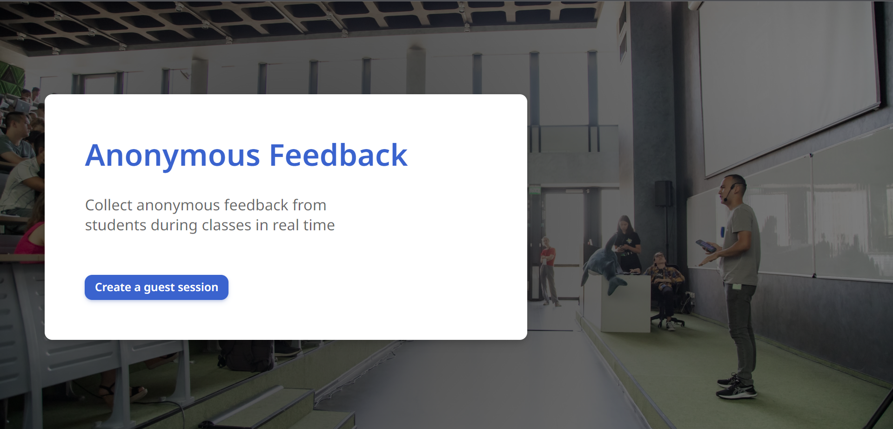
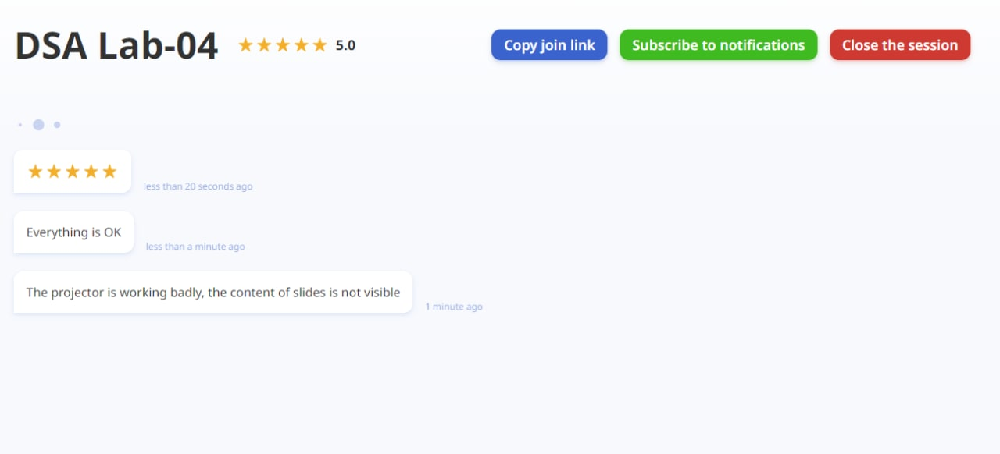

# [Anonymous Feedback](https://anonymous-feedback.snejugal.ru)

[](https://github.com/marketplace/actions/super-linter)


Collect anonymous feedback from students during classes in real time. Go to <https://anonymous-feedback.snejugal.ru> to get started!

## Screenshots

### Home screen



### Feedback session page



## How to use

**For instructor:**
1. Go to <https://anonymous-feedback.snejugal.ru>
2. Create a guest session
3. Share the join link with students
4. Collect feedback from students
5. Close the session
6. Export the session

**For student:**
1. Follow the join link sent by the instructor
2. Сlick on the start button
3. Send feedback

## Feature list

1. Creating feedback guest session
2. Sharing feedback session
3. Join feedback session
4. Leaving feedback
5. Notifications about the feedback
6. Export sessions
7. Show connection status

## Run locally

Before following the steps, ensure that you have Docker installed.

1. Create `.env` according to [`example.env`](./example.env);

2. To run the project, run the following command:

    ```bash
    docker compose up
    ```

    Add the `--build` flag to rebuild the project before running.

## Stack

- **Backend:**
  - Docker
  - PostgreSQL
  - Python
  - Strawberry
  - Tortoise ORM
  - Starlette

- **Telegram bot:**
  - aiogram
  - PostgreSQL
  - RedisDB
  
- **Frontend:**
  - TypeScript
  - React
  - SCSS
  - Apollo Client
  - React Router

## License

This project uses the [MIT License](./LICENSE).
